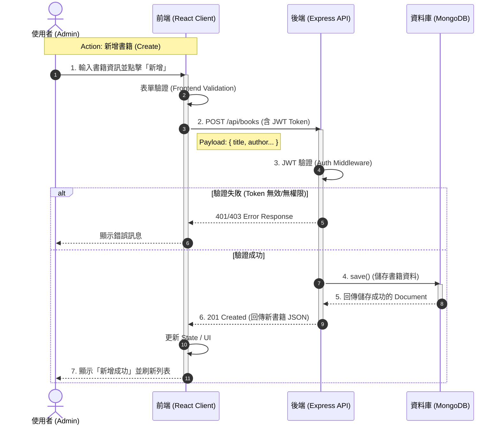

# 系統架構與流程圖 (Architecture & Flowcharts)

本文件展示 **圖書借閱系統** 的系統架構與資料處理流程。

## 1. 系統架構圖 (System Architecture)

本系統採用 **MERN Stack** (MongoDB, Express, React, Node.js) 架構。

*   **Frontend (使用者介面)**: 使用 React 建構，負責畫面顯示與使用者操作。
*   **Backend (API 伺服器)**: 使用 Node.js 與 Express 建構，負責商業邏輯與 API 路由。
*   **Database (資料儲存)**: 使用 MongoDB，儲存書籍與使用者資料。

```mermaid
graph TD
    %% 定義節點樣式
    classDef client fill:#e1f5fe,stroke:#01579b,stroke-width:2px;
    classDef server fill:#fff3e0,stroke:#e65100,stroke-width:2px;
    classDef db fill:#e8f5e9,stroke:#1b5e20,stroke-width:2px;
    classDef user fill:#f3e5f5,stroke:#4a148c,stroke-width:2px;

    User((User 使用者)):::user
    
    subgraph Client Side [前端 Client]
        ReactApp[React Application\n(Vite Server)]:::client
        Router[React Router]:::client
        Axios[Axios HTTP Client]:::client
    end

    subgraph Server Side [後端 Server]
        Express App[Express Server]:::server
        AuthMid[Auth Middleware\n(JWT Check)]:::server
        Controller[Controllers\n(Business Logic)]:::server
    end

    subgraph Database [資料庫]
        MongoDB[(MongoDB)]:::db
    end

    %% 連線關係
    User -->|瀏覽/點擊| ReactApp
    ReactApp --> Router
    ReactApp -->|1. 發起請求| Axios
    
    Axios -->|2. HTTP Request (REST API)| Express App
    Express App --> AuthMid
    AuthMid --> Controller
    
    Controller <-->|3. Mongoose Query| MongoDB
    
    Controller -->|4. JSON Response| Express App
    Express App -->|5. HTTP Response| Axios
    Axios -->|6. Update State| ReactApp
    ReactApp -->|7. 更新畫面| User
```

---

## 2. CRUD 流程圖 (CRUD Flowchart)

以下使用 **循序圖 (Sequence Diagram)** 描述使用者執行 CRUD 操作時，資料如何在各層之間流動。
以 **「管理員新增書籍 (Create)」** 為例，其他讀取 (Read)、更新 (Update)、刪除 (Delete) 流程皆類似。

### 流程說明
1.  **使用者** 在前端填寫表單並送出。
2.  **前端** 發送 POST 請求至後端 API，Header 附帶 JWT Token。
3.  **後端** 中介軟體 (Middleware) 驗證身份。
4.  **後端** 處理邏輯並將資料存入 **資料庫**。
5.  **資料庫** 回傳儲存結果。
6.  **後端** 回傳成功訊息與新資料給 **前端**。
7.  **前端** 更新畫面提示使用者。


